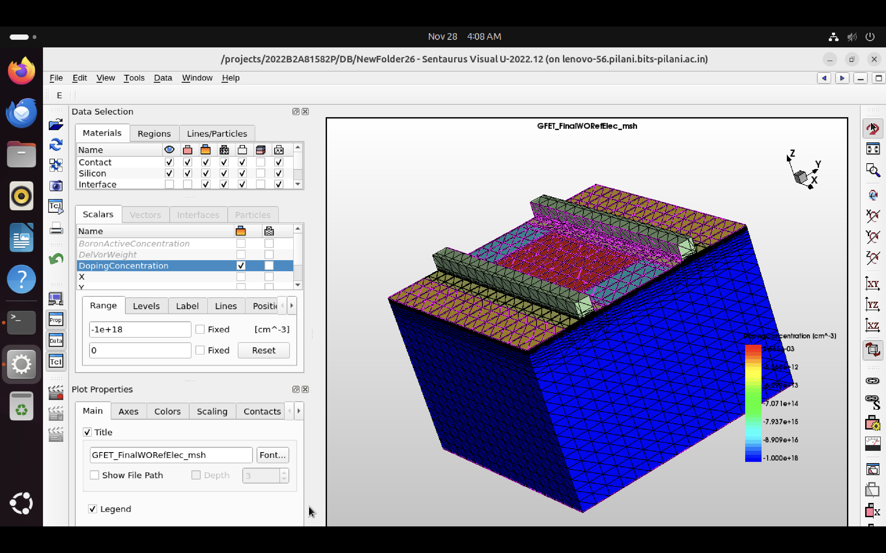
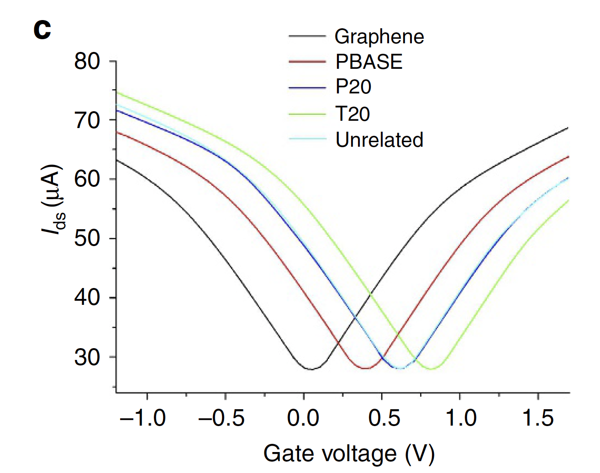
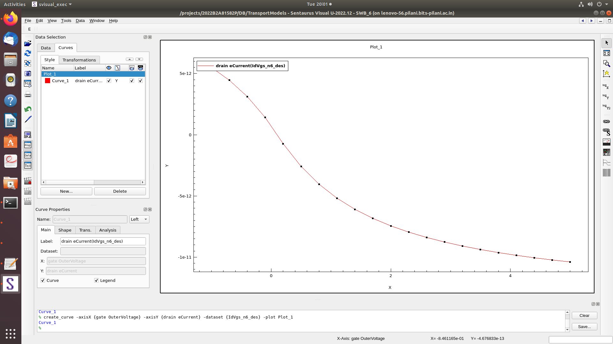

# Graphene Field-Effect Transistors (GFET) Nanobiosensors

## Abstract & Overview
This project explores the design, theoretical modeling, and computational simulation of a **Graphene-based Nanobiosensor** using TCAD Sentaurus. Field-Effect Transistor (FET) biosensors leverage intrinsic charge properties of biomolecules to achieve label-free detection. 

By replacing traditional silicon with a single-atomic-layer of Graphene—which has extraordinary electronic properties and high carrier mobility—the sensor achieves ultra-sensitivity. This research focuses on utilizing GFETs for the rapid and label-free detection of viral diseases, genetic variations, and biomarkers like Monoclonal antibodies (IgG) and alpha-fetoprotein (AFP).

## Computational Simulation (TCAD Sentaurus)

The physical structure and electrical characteristics of the GFET were modeled and meshed using the Sentaurus Structure Editor (SDE) and Sentaurus Device (SDEVICE) tools. The raw simulation code is provided in this repository:

* 📄 **[`sde_structure_mesh.scm`](sde_structure_mesh.scm)**: The Scheme-based SDE script that mathematically generates the 3D cuboid structures, dielectric masks, and defines the complex meshing refinement windows for the GFET.
* 📄 **[`sdevice_simulation.cmd`](sdevice_simulation.cmd)**: The SDEVICE command script that defines the physical models (Fermi, SRH Recombination, OldSlotboom) and configures the Quasistationary gate voltage sweeps to plot the Drain Current characteristics.

### 3D Structure & Meshing

*(3D meshed structure of the GFET generated on the SVISUAL tool)*

### Device Architecture
Due to fabrication constraints, the computational model utilized electrically similar substitute materials while retaining the exact geometric behavior of a pure GFET:
* **Substrate & Insulator**: Silicon (150µm x 150µm) topped with a 90nm $SiO_2$ dielectric layer.
* **Channel**: Modeled as a thin high-mobility layer (Polysilicon as a Graphene analog in the simulation environment) with dimensions 90µm x 53µm.
* **Contacts (Source/Drain/Gate)**: Titanium adhesion layers topped with Gold (Au) for high conductivity and stable contact.
* **Dielectric Masking**: $Si_3N_4$ regions implemented to isolate specific sensing regions.

### Key Simulation Findings
1. **Charge Screening Reduction**: Deformed/concave nanoscale structures in the graphene layer minimize charge screening (Debye screening), drastically enhancing sensitivity to target molecules.
2. **Electrical Hotspots**: Simulation confirms that nanoscale deformations act as localized regions of extreme sensitivity, enabling the detection of biomolecules at attomolar concentrations.

## Results Analysis

The simulation sweeps the Gate Voltage (0V to 5V) to observe the Drain Current ($I_{ds}$). 

*Note: The images below display the expected theoretical ambipolar response of Graphene vs. the experimental results obtained from our TCAD simulations.*

### Theoretical / Expected Result

*A clear symmetrical V-shape demonstrating the ambipolar conduction nature of graphene around the Dirac point.*

### Experimental TCAD Result

*Our simulation displayed an exponentially decaying curve. Detailed analysis in the report traces this deviation to limits in drift-diffusion models for atomically thin 2D materials, emphasizing the need for Monte Carlo or quantum transport simulation models for perfect graphene replication.*

## Repository Contents
* `GFET_Research_Report.pdf`: The comprehensive Study Oriented Project (SOP) report submitted to BITS Pilani, containing full literature reviews on probe functionalization (DNA/IgG/Fab) and in-depth SDE code snippets.
* `sde_structure_mesh.scm`: The raw SDE structure generation code.
* `sdevice_simulation.cmd`: The SDEVICE setup configuration.
